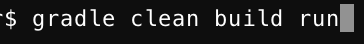

# Administration manual

#  TicTacToe 

## 1. How to set up project and get it to run

In order to set this project up and get it to run you need to have gradle set up on your git bash(Windows) or terminal(Linux or Mac). To set up project you must go to
https://github.com/losamigos2/TicTacToe and clone project to your own machine using git bash or terminal with the command:
git clone: https://github.com/losamigos2/TicTacToe.git:

/**/

When you have done so you can find the project on your machine where you cloned it. To run the project you need to use the command: gradle clean build run

which makes the git bash/terminal run the game where you can play it.

## 2. How to install and run the program on clients machine

(in case of simple desktop program).

## 3. How to deploy, run and maintain in case of client/server or web application.

Text here

