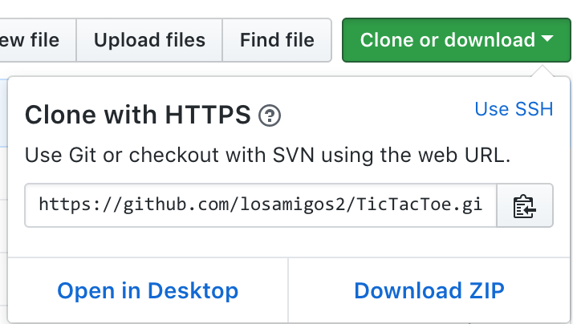

# Administration manual

# TicTacToe

<<<<<<< HEAD
## 1. How to set up project and get it to run
=======
## 1. Introduction

This manual is intended for system administrators. It is ideal that the administrators have basic knowledge of Test Driven Development, or TDD, and also Java, Gradle, Travis and Heroku.

## 2. How to set project up and get it to run
>>>>>>> 1990e96652dd83e32181e59ef93f8764dcde016a

In order to set this project up and get it to run you need to set up gradle on your git bash(Windows) or terminal(Linux or Mac). To set up project you must go to
https://github.com/losamigos2/TicTacToe and clone project to your own machine using git bash or terminal with the command:
git clone: https://github.com/losamigos2/TicTacToe.git:

When you have done so you can find the project on your machine where you cloned it. To run the project you need to use the command: gradle clean build run

which makes the git bash/terminal run the game where you can play it.

## 3. How to install and run the program on clients machine

(in case of simple desktop program).

<<<<<<< HEAD
## 3. How to deploy, run and maintain in case of client/server or web application.
=======
## 4. How to deploy, run and maintain in case of client/server or
web application.
>>>>>>> 1990e96652dd83e32181e59ef93f8764dcde016a

Text here

