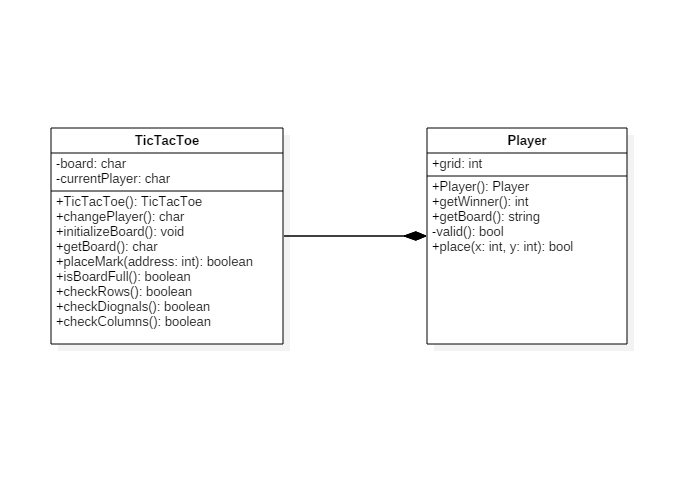

# Design Report

#  TicTacToe

## 1. Introduction

<pre>
> This project is a simple and fun game of <b>TicTacToe</b>. TicTacToe is a game where there are two players against each other and try to have either three <b>X's</b> or <b>O's</b> in a row, depending on which they represent. There is an image of the TicTacToe board for the project in the <i>Prototypes</i> section and a more detailed design of it can be seen in the <i>Graphic design</i> section. In the Class diagram section is a diagram of the two classes that represent this project, which are the <i>business layer</i> and the <i>user interface layer</i>.
</pre>

## 2. Prototypes

### Wireframe

### Graphic Design

## 3. Class Diagram

A class diagram shows the relationships between classes, objects, attributes and operations. It resembles a flowchart in which classes are portrayed as boxes, each box showing the name of the class, attributes are and methods. There are two classes in this system, an **user interface class** and a **service class**. The UI class gets information from user and displays that information. The service class handles all calculations and main functions for the system.

## 4. Programming rules

There were a few programming rules made for this project which include i.e. that classes must be named with **PascalCasing**. They also include that variables must be written with **lower camel casing** and brackets are always written **in line** with functions, not below them. This is so that the code will be neat, clean and easy to read. Indentation is always four white spaces (tabs) and the language which the code is written in is **Java**. There must be a *single white space* between functions in order so separate them nicely. 

`sample`**`sample`**`sample`
*`rename`*`'s/\.bak$//' *.bak`