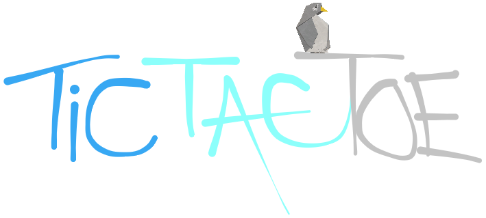

# Development Manual



## 1. Introduction
This manual is intended for system developers. It is ideal that the administrators have basic knowledge of Test Driven Development, or TDD, and also git, Gradle and Java.

## 2. What software you need
> [git](https://git-scm.com/downloads)

> [Gradle](https://gradle.org/install/)

> [Java v.8](https://java.com/en/download/)

## 3. How to get started
To get started you need you install the software described above if you do not have them on your machine.  
When finished you can clone the project onto your development machine from the projects [respository](https://github.com/losamigos2/TicTacToe)
 using the command: git clone https://github.com/losamigos2/TicTacToe.git


## 4. How to build and run locally
In order to clean, build and run the program on your local machine you need to run from the root of the project the command:

```./gradlew clean build run```

*The program should run on either your git bash (Windows) or terminal (Linux or Mac)*

## 5. How to handle new changes
You should work on new features on a new branch, which would be named the same as the feature, for simplicity. Then when adding the new feature that is ready you should follow this procedure:

> git status

> git checkout -b <b>new branch</b>

> git add .

> git commit -m "informative commit message"

> git push origin <b>the new branch</b>

After this a pull request is made, then other members of the team approve and merge to master.  
*Note: You do not have to branch out when updating documents*

## 6. Coding rules
Appropriate coding rules can be found in the [Design Report](https://github.com/losamigos2/TicTacToe/blob/master/docs/DesignReport.md), chapter 4.
